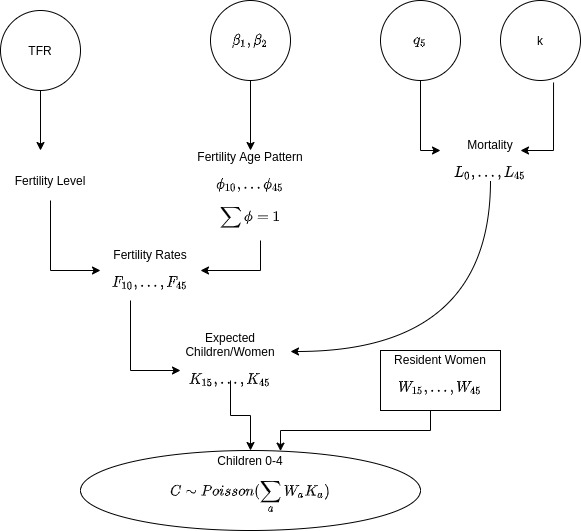
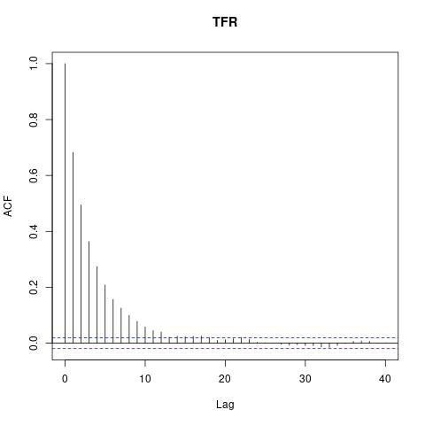

# Bayesian Estimation 
## of total fertility from a population’s age-sex structure

 

|  |  |  |  |
|----|---|--|--|
|Shobhit Patel (shob@iitk.ac.in)|180732|Adarsh Pal (palad@iitk.ac.in)|180032|
|Amol Mishra (amolm@iitk.ac.in)|180082|Naman Gupta (namang@iitk.ac.in)|180458|
|Rishabh Kothary (rishk@iitk.ac.in)|180608|
---

# Objective

 
 
 

#### The primary objective of the paper is to model the distribution of the TFR (Total Fertility Rate) conditional on the number of women in the childbearing age. The approach used is bayesian, in which unknown demographic quantities are parameters with prior distributions. 

 
 

The model is applied on two datasets, having considerably varying results in TFR distribution due to their respective population’s age-sex structure.

 
 

1. Amazon region of Brazil
2. 159 counties in the US state of Georgia

---

# Basic Terminologies

We assume that fertility rates are positive over the age interval $[15,50)$ and zero at all other ages. Some basic terminologies to understand the report are :

- **Age group a** : Defined as the interval $[a, a + 5)$.
- **Life Table** : A life table is a table which shows, for a person at each age, what the probability
is that they die before their next birthday.
- **$l_a$** : Number of people in life table surviving to age group $a$.
- **$L_a$** : Total aggregate of person-years lived in the age group a by the number of people in life
table.
- **Radix** : Number of births in life table. For this report it is set to $1$.
- **$s$** : Total aggregate number of children alive through the age group $[0, 5)$. As the radix is 1 it
can also be interpreted as the expected fraction still alive among children born in the past five
years. For the case where radix is 1,
$s = L_0/
5$
- **$f_x$** : Average fertility of woman of age $x$. Is defined as the ratio of births and woman at the age
$x$ in the year average fertility is recorded
- **$F_a$** : Average fertility of woman in age group a. Mathematically,
$F_a = \frac{1}{5}\displaystyle\sum_{x\in a} f_x$

---

# Basic Terminologies

 

- **$TFR$** : Also known as the total fertility rate is interpreted as the number of children a woman
will have over her entire lifetime. Mathematically, 

$TFR = \displaystyle\sum_{a}5F_a$

- **$\phi_a$** : Is defined as the fraction of total fertility occurring in age group $a$. Mathematically,
$\phi_a = \frac{5F_a}{TFR}$
- **$W_a$** : The number of woman in the age group $a$ observed.
- **$W$** : The total number of woman observed in the child-bearing age. Mathematically,
$W = \displaystyle\sum_a W_a$
- **$K_a$** : The expected number of surviving $0 − 4$ year old children of both sexes per woman in age
group $a$ at the end of a five year period with the condition that the mother belongs in this age
group. Using Cohort Projection methods it has been found that

$\ \ \ \ K_{a}=\left[\frac{L_{a-5}}{L_{a}}\cdot F_{a-5}+F_{a}\right] \frac{L_{0}}{2}$
        $\ =\ TFR \cdot \frac{L_0}{5}\cdot\frac{1}{2}\left( \frac{L_{a-5}}{L_{a}} \cdot \phi_{a-5}+\phi_{a} \right)$
        $\ =\ TFR \cdot s \cdot p_a$

---

# Basic Terminologies

- **$C$** : The expected total number of surviving $0−4$ year old children in a population with $W_{15}, ...W_{45}$
women in child bearing age groups $15\ to\ 19$ through $45\ to\ 49$. Mathematically,

$\ \ \ \ \ \ \ \ \ \ \ \ \ \ \ \ \ \ \ \ \ \ \ \ \ \ \ \ \ \ \ \ C\ =\ \displaystyle\sum_{a}\ W_a\ K_a = TFR \cdot s \cdot \left( \displaystyle\sum_a W_a p_a  \right)$
- **$CWR$** : It is defined as the ratio of expected number of surviving $0\ to\ 4$ year old children to the
total number of woman in the childbearing age. Mathematically,

$\ \ \ \ \ \ \ \ \ \ \ \ \ \ \ \ \ \ \ \ \ \ \ \ \ \ \ \ \ \ \ CWR = \frac{C}{W} = TFR \cdot s \cdot \left (  \displaystyle\sum_a  \frac{W_a}{W}p_a \right) = TFR \cdot s \cdot \bar{p}$
- **$1/\bar{p}$** : Is defined as the age structure multiplier that depends on fertility rate,mortality rate and
the number of women observed. It is weighted average of the total fertility observed in each
age group.
- **iTFR** : Is known as the implied Total Fertility Rate and it estimates total fertility from age- and sex-specific population only.

---

<!--  -->

We model $C$ as a random variable as there is always uncertainty involved in the number of children, as the demographic quantities are not truly constant since fertility age patterns and mortality schedule cannot be known with certainty. We assume that the expected value of
 $C = \sum_a W_aK_a$. The figure shows a hierarchical model for the Bayesian approach for finding $TFR$ conditioned on $C$ and $W$. We specify priors on $q_{5}$, $\beta$ and $k$, and then examine $P(TFR | C, W)$ the posterior distribution of TFR conditional on the data and the priors. The following are the different parameters of the model.

---

# Fertility 

Parameters and Prior

**Parametres**  $\ \rightarrow\ \phi_{a's}$

 

$\phi_{a's}$ modelled as $\ \rightarrow\  \ \phi_a = \frac{exp(\gamma_{a})}{\displaystyle\sum_{z}\exp(\gamma_{z})} \text{ where } \gamma_{a} \text{ is modeled as the co-ordinates of } \gamma = m + X\beta$
**Note** : Each $\gamma_{a}$ is modelled as $\gamma_a = \ln{\frac{\phi_a}{\phi_{15}}}$ and this is possible because $\sum_a \phi_a = 1$.

 

$m$ and $X$ are constants estimated using HFD and US Census Bureau’s International Database and are as follows
$\ \\\ \ \ \ \ \ \ \ \ \ \ \ \ \ \ \ \ \ \ \ \ \ \ \ \ \ \ \ \ \ \ \ \ X^\top = 
\begin{pmatrix}
0 & 0.27 & 0.54 & 0.73 & 0.88 & 1.04 & 1.52\\
0 & 0.32 & 0.51 & 0.51 & 0.35 & 0.05 & −0.72
\end{pmatrix}\\$
$\\\ \\\ \ \ \ \ \ \ \ \ \ \ \ \ \ \ \ \ \ \ \ \ \ \ \ \ \ \ \ \ \ \ \ \ m^\top = \begin{pmatrix}
0 & 1.39 & 1.59 & 1.23 & 0.45 & −0.89 & −3.44
\end{pmatrix}$

---

**Note** : These $m$ and $X$ are such that the elements of $\beta_{i's}$ had zero mean, unit variance and zero co-variance over the empirical data. Also examination of $X$ matrix shows that $\beta_1$ affects the mean age of child-birth and $\beta_2$ affects its variance.

 

Finally, $F_{a's}$ are calculated as $\ \rightarrow\ (F_{10}, F_{15}, ..., F_{45}) = \left(\frac{TFR}{5}\right)\cdot(0, \phi_{15}, ..., \phi_{45})$

 

**Priors** : 
- $\beta \sim \mathcal{N}(0, I_{2})$
- non informative prior $T$ $\sim$ Uniform(0, 20) for $TFR$

---

# Mortality

Parameters and Prior

**Parameters** : 
- $q_{5} \rightarrow$ probability of death before age 5 
- $k \rightarrow$ shape parameter typically in the range $[-2,2]$ 

 

Mortality rates $\mu_x$, for age group $x$ is calculated using the following equation

$\ \\ \ \ \ \ \ \ \ \ \ \ \ \ \ \ \ \ \ \ \ \ \ \ \ \ \ \ {\ln \mu_{x}\left(q_{5}, k\right)=a_{x}+b_{x}\left[\ln q_{5}\right]+c_{x}\left[\ln q_{5}\right]^{2}+v_{x} k, \quad x=0,1,5,10, \ldots, 45 .}\ \\\ \\$
Here, mortality rates, $\mu_{0}$ and $\mu_{1}$ refer to the age intervals $[0, 1)$ and $[1, 5]$
respectively and all other $\mu_{x}$ refer to the interval $[x, x+5)$
calculating $\mu_{1}$ using $\mu_{1}$ = -0.25 * $[\mu_{0} + ln(1 - q_{5})]$. Also $a_{x}, b_{x}, c_{x}$ estimated using bi-weighted OLS and $v_x$ using SVD on resulting residuals. The data used for these estimations were from the schedules in HMD. 

---

Further, survival probabilities to exact ages are calculated as $l_{0}$ = 1, $l_{1}$ = $e^{-\mu_{1}}$ and $l_{x} = l_{x-5}$  $e^{-5\mu_{x-5}}$ for x = 10,..., 45.

 

Finally, life table person-years are calculated as $L_{0} = (1/2)(l_{0} + l_{1}) + (4/2)(l_{1} + l_{5})$ and $L_{a} = (5/2)(l_{a} + l_{a+5})$.

 

**Priors** : 
- $q_{5}$ $\sim$ Beta[a($\hat q_{5}$), b($\hat q_{5}$)], where a($\hat q_{5}$), b($\hat q_{5}$) are chosen so that
$\ \\\ \\\ \ \ \ \ \ \ \ \ \ \ \ \ \ \ \ \ \ \ \ \ \ \ \ \ \ P\left[q_{5} < \frac{1}{2} min(\hat q_{5})\right] = P\left[q_{5} > 2 \text{ }max(\hat q_{5})\right] = 0.05\ \\ \ \\$
- $k \sim \mathcal{N}(0, 1)$

---

# Expected number of surviving children
We find the expected number of surviving 0-4 year-old children of both sexes per woman in age group a = 15, 20, ..., 50 at the end of 5 year period, as - 

$\ \\ \ \ \ \ \ \ \ \ \ \ \ \ \ \ \ \ \ \ \ \ \ \ \ \ \ \ \ \ \ \ \ \ \ \ \ \ \ \ \ \ \ \ \ \ \ \ \ \ \ \ \ \ \ \ \ \ K_{a} =\left[\frac{L_{a-5}}{L_{a}} \cdot F_{a-5}+F_{a}\right] \frac{L_{0}}{2}$

The expected number of surviving children for the $W_{a}$ women observed in age
group a is $W_{a}K_{a}$, and the observed number of their surviving children is modelled as $C_{a} \sim Poisson(W_{a}K_{a})$. It is assumed that $C_{a}$ values are
statistically independent, conditional on fertility and mortality rates, so that their sum is also a Poisson variable. $C=\sum_{a} C_{a}$ is also a Poisson random variable. Thus,
$$
C \mid \text { TFR }, \boldsymbol{\beta}, q_{5}, k \sim \operatorname{Poisson}\left[\sum_{a} W_{a} K_{a}\left(\text { TFR }, \boldsymbol{\beta}, q_{5}, k\right)\right]
$$
---

# Posterior Distribution of TFR

The posterior distribution conditioned on data is
$\\ \ \ \ \ \ \ \ \ \ \ \ \ \ \ \ \ \ \ \ \ \ \ \ \ \ \ \ \ \ P(\text{TFR}, \boldsymbol{\beta}, q_{5}, k \mid \text { C})  \propto L(C \mid \text {TFR}, \boldsymbol{\beta}, q_{5}, k) f_\beta(\boldsymbol{\beta}) f_q(q_{5}) f_k(k)$

where the likelihood is the Poisson distribution in subsection 3.3 and the other functions are the priors mentioned in above sections. The marginal posterior for TFR given the number of children C and counts of woman for each age group is given by
$$ P(\text{TFR} \mid \text { C}) \propto \int L(C \mid \text {TFR}, \boldsymbol{\beta}, q_{5}, k) f_\beta(\boldsymbol{\beta}) f_q(q_{5}) f_k(k)d\boldsymbol{\beta}dq_{5}dk $$

The paper samples from the full posterior distribution by applying Markov Chain Monte Carlo (MCMC) methods. Specifically, we programmed the model JAGS package in R.
---

# Case Studies

#### A small indigenous population in the Brazilian Amazon
The Kanamari Indigenous Territory in the Brazilian state of Amazonas, had $C = 191$ resident children in ages 0-4 and $W = (40, 34, 29, 19, 14, 9, 8)$ resident women in the age groups 15-19 through 45-49 in the 2010 data.
- $q_5 \sim  Beta(3.99, 114.26)$
- $a_f, b_f, c_f, v_f$ values taken from the dataset
- MCMC Sampling: 20000
- Burn-in Period: 1000
- Thinning: 10
- Number of chains: 2
---

# adsfsdfs A

---
Trace Plot for TFR             |  ACF Plot for TFR
:-------------------------:|:-------------------------:
  |  
---